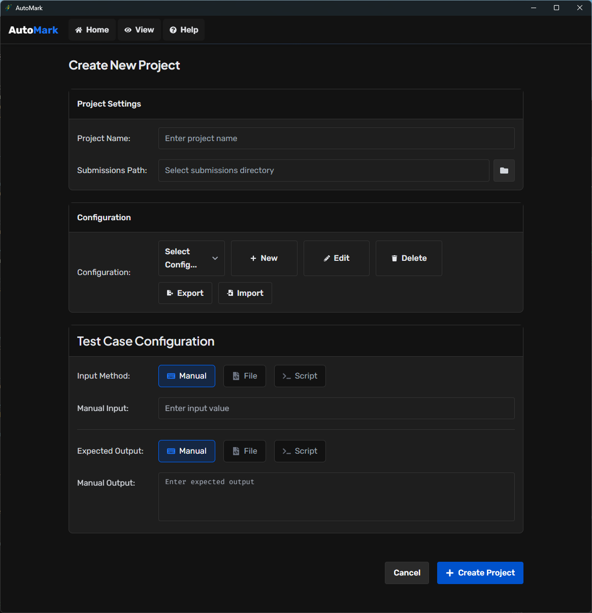
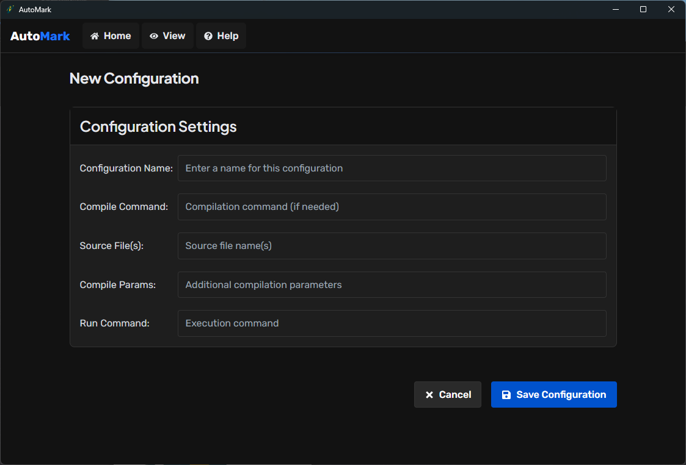

# Automark

**AutoMark** is a desktop application designed to automate the compilation, execution, and evaluation of programming assignments submitted by students. Built using Electron, React, and Node.js, it provides a simple and modern interface for instructors to configure test cases, import student submissions, and view detailed reports on code correctness.

## Features

- **Project-based Evaluation**  
  Create separate projects for each assignment with custom test configurations.

- **Flexible Configuration System**  
  Define compilation and execution settings for different programming languages (e.g. Java, C, Python).

- **Multiple Input/Output Methods**  
  Supports manual input/output, file-based testing, and command/script-based automation.

- **Automatic ZIP Extraction**  
  Imports student submissions in .zip format and organizes them based on student ID.

- **Automated Compilation and Execution**  
  Compiles each submission using the provided configuration and executes it with test input.

- **Output Comparison Engine**  
  Compares the actual program output with the expected output and determines success/failure.

- **Detailed Result Reports**  
  Displays per-student results including status (compiled, executed, success, failed) and error messages.

- **Modular Backend with SQLite**  
  Uses SQLite for lightweight storage and structured submission tracking.

- **Clean, Modern Interface**  
  Built with React and Tailwind CSS for a responsive and accessible UI.

## Installation and Running

### Download the App

You can download the latest release of AutoMark as a desktop application:

[Download from GitHub Releases](https://github.com/ahmet-ciftci/AutoMark/releases)

Just download the `.exe` file and run it directly — no installation required.

---

### Run from Source

If you prefer to run the app from source, follow these steps:

1. Clone the repository:
   ```bash
   git clone https://github.com/ahmet-ciftci/AutoMark.git
   cd AutoMark
2. Install dependencies:
    ```bash
    npm install
3. Build Frontend:
    ```bash
    cd frontend
    npm install
    npm run build
    cd ..
4. Start the Electron app:
    ```bash
    npm start

## Usage
AutoMark is designed to guide instructors through evaluating student programming submissions efficiently. Here's how to use each section of the app:

### Create Project

> Set up a new project and import student submissions.
<div align="center">
  
</div>
&nbsp


- Enter a **project name**.
- Select the **submissions folder** (Folder that contains ZIP files named by student number).
- Choose the **configuration** created earlier.
- Define test input & expected output:
  - Manual value
  - Input/output file
  - Or a shell script command
- Click **Create Project**.

AutoMark will:
- Extract ZIPs
- Compile code
- Run each program with test input
- Compare outputs
- Save results
---

### Create New Configuration

> Configure how submissions will be compiled and executed.

<div align="center">
  
</div>
&nbsp


- Go to the **New Configuration** tab by clicking +New in Configuration part on Project window.
- Define:
  - A name for the config (e.g. `Java`, `C`)
  - Compile command (`javac`, `gcc`)
  - Source file name (`Main.java`, `Main.c`)
  - Optional compile parameters (`-encoding UTF-8`, `-o Main.exe`)
  - Run command (`java Main`, `./Main.exe`)
- Save the configuration.

---

### Submission Reports
> Review each student's result and status.

<div align="center">
  
</div>
&nbsp


- **Submission Reports** tab automatically opens after execution and evaluation.
- See detailed status(success, failed)
- Error messages and actual outputs are also displayed for debugging.

---

### 4. File Explorer

> Browse raw extracted files.

<div align="center">
  
</div>
&nbsp

- Navigate to the **File Explorer** tab.
- View extracted student folders and source files.

### 5. File and Help Menu
> Handle project operations.

<div align="center">
  
</div>

- **New Project** (Ctrl+N):  
  Starts a fresh project from scratch.

- **Open Project** (Ctrl+O):  
  Allows you to reopen a previously saved project (if project saving is implemented).

- **Save Project** (Ctrl+S):  
  Saves the current project state.

- **Save Project As** (Ctrl+Shift+S):  
  Saves the current project under a new name or location.

- **Close Window** (Alt+F4):  
  Closes the application window.

- **Exit**:  
  Quits the application.

- **Help**:  
  Access the inbuilt Help menu for detailed instructions on using the application.

## Reporting Issues

If you find a bug or want to suggest a new feature, please open an issue on the GitHub repository.
